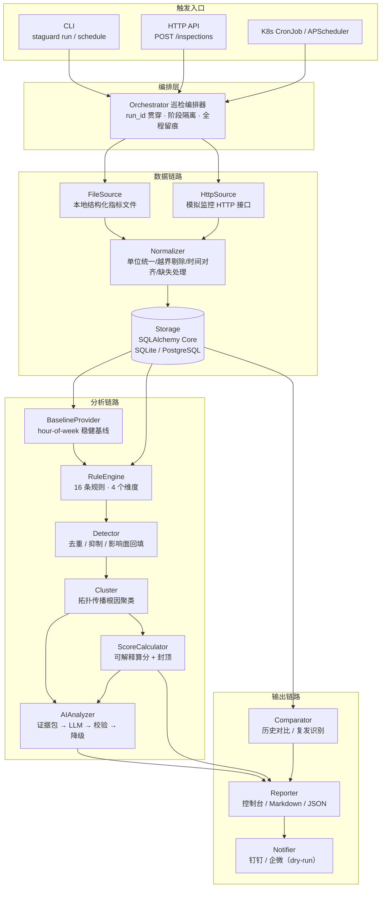
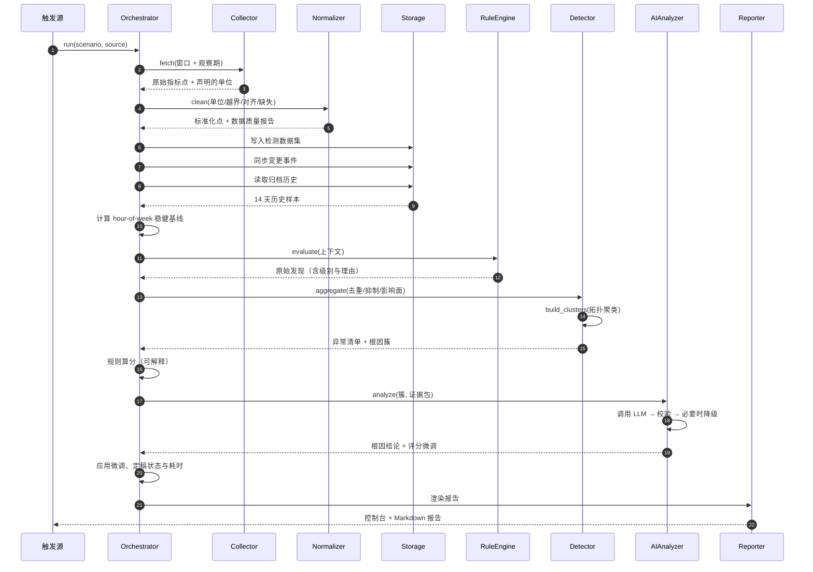

# StaGuardAgent 系统设计文档

> 配套代码：`staguard/`　|　配套配置：`config/`　|　配套测试：`tests/`

---

## 一、整体架构

## 二、巡检时序

## 三、模块职责

| 模块 | 职责 | 关键设计 |
| --- | --- | --- |
| `models/` | 领域模型，所有跨模块数据结构的唯一定义 | 业务代码不碰裸 dict；异常分「原始发现 → 去重异常 → 根因簇」三层 |
| `config/` | 环境变量 + 5 份 YAML 策略配置（服务拓扑 / 阈值 / 规则 / 评分 / 场景） | 全部可配，改策略不改代码；启动期强校验，配置写错直接启动失败 |
| `dataset/` | 模拟数据集生成与文件化 | 两层数据：14 天干净归档（供基线）+ 场景高精度切片（含注入）；固定随机种子保证可复现 |
| `collector/` | 数据接入抽象 | 两条通道共用同一份底层数据，结果必然一致；源可插拔，接 Prometheus 只加一个实现 |
| `normalize/` | 标准化清洗 | 四步清洗，每一步对应一类真实踩坑；长缺口**不插值**（避免把「监控挂了」伪装成「一切正常」） |
| `store/` | 结构化存储 | SQLAlchemy Core，SQLite/PG 可切；幂等建表 + 结构漂移自愈；epoch 存储消灭时区 bug |
| `rules/` | 规则引擎 | 规则 Protocol + YAML 驱动；阈值按服务红线自动缩放；趋势规则强制显著性检验 |
| `detect/` | 聚合与聚类 | 去重、跨规则抑制、影响面回填、拓扑传播聚类、主根因加权选取 |
| `ai/` | AI 归因 | 证据包只放事实；强 schema 校验 + 幻觉引用清理 + 漏答补齐；两级降级兜底 |
| `scoring.py` | 稳定性评分 | 错误预算口径 + 可解释扣分明细 + 最严格封顶生效 |
| `report/` | 报告输出 | 固定七章结构；控制台与 Markdown 信息密度取法不同 |
| `notify/` | 告警推送 | 只推 P1/P2（告警疲劳比漏报更致命）；默认 dry-run 落盘 |
| `orchestrator.py` | 编排 | 10 阶段隔离、阶段耗时留痕、状态诚实（成功/部分降级/失败） |
| `api.py` | 服务化 | `/readyz` 真实检查依赖，不是 `return 200` |
| `scheduler.py` | 定时调度 | 吞掉异常避免调度器被一次数据库抖动干掉 |

## 四、巡检流程的十道工序

编排器把巡检拆成十个可独立观测、可独立降级的阶段：

| 阶段 | 动作 | 失败后的行为 |
| --- | --- | --- |
| `collect` | 拉取窗口 + 观察期数据 | 无数据则产出「无法评估」报告，明确说明原因 |
| `normalize` | 单位统一、越界剔除、时间对齐、缺失处理 | 产出数据质量报告，置信度下调 |
| `store` | 落库 + 同步变更事件 | 主流程照常，报告缺少变更章节 |
| `baseline` | 计算 hour-of-week 稳健基线 | 覆盖率不足时标记降级，结论置信度下降 |
| `rule_engine` | 执行 16 条规则 | 单条规则失败只记录，不影响其它规则 |
| `aggregate` | 去重、抑制、影响面回填、拓扑聚类 | 异常清单为空但报告可出 |
| `score` | 规则算分 + 封顶 | 评分缺失，报告标注 |
| `ai_analysis` | 证据包 → LLM → 校验 → 降级 | **必然**产出结论（降级链是确定性的，永不失败） |
| `report` | 渲染并落盘 | 磁盘写入失败时仍可通过接口获取 |
| `notify` | 推送 P1/P2 | 推送失败只记录，不影响报告 |

**为什么是十道而不是一段脚本**：每一道都能单独回答「耗时多少、有没有失败、为什么降级」。
线上排查「今天为什么没报警」时，这份阶段流水是唯一的抓手。

## 五、关键设计决策（ADR）

### ADR-1 评分由规则算出，AI 只做 ±5 微调

**问题**：题目要求 AI 输出 0-100 的稳定性评分，但大模型对数值的直觉不可靠。

**决策**：规则引擎按可解释的扣分模型算分，AI 只能对最终分数做 ±5 的微调。

**理由**：
1. 可复现——同一份数据必须得到同一个分数，否则多次巡检对比没有意义；
2. 可解释——报告能逐项回答「这 12 分扣在哪」；
3. 抗幻觉——让模型承担它擅长的（归因、表达），不承担需要一致性的（打分）。

### ADR-2 证据包只放事实，不放规则结论

**问题**：直接把规则输出交给模型，它会倾向于复述。

**决策**：证据包只包含客观事实（指标偏离、拓扑、变更、历史同类事件），
规则侧的推测单独放在 `rule_hypothesis` 字段，并在提示词里明确说明它只是待验证猜想。

**理由**：喂结论，模型复述结论；喂事实，模型才可能做推理。
而它由此给出的独立判断，才**有资格**和规则假设做交叉验证——
报告里两者不一致时会显式标注 `⚠️ 与规则假设不一致`。

### ADR-3 两级降级，AI 不可用也必须出报告

**决策**：降级链只有两级——大模型 → 规则决策树。降级路径与原因写入 `AIMeta.degraded`。

**理由**：大模型会因为没配 key、网络抖动、限流、返回格式异常而不可用。
「因为 AI 挂了所以今天不出巡检报告」在任何生产环境都不可接受。
降级不是返回空结果，而是一棵按证据特征判定的决策树——它不如模型会读上下文，
但**永远可用、永远确定性、永远不会编造**。

**为什么不设第三级**：早期文档写过「大模型 → 规则决策树 → 纯统计」三级，但决策树按构造
不会失败，独立的第三级就是一段永远不会被走到的死代码。真正需要的能力——
「证据不足以定性时只陈述事实、不做因果断言」——由决策树内部返回 `unknown` 的分支承担。
能力在那儿，阶层在文档里是多余的。

### ADR-4 故障数据与基线数据分离存储

**决策**：`metric_points` 用 `dataset_id` 分区，`archive` 存放 14 天干净历史，
场景数据带故障注入另存。

**理由**：动态基线从历史样本计算，如果历史里混着被注入的故障，
基线会被永久抬高——此后同类故障全部漏报，而且**失效方式是静默的**。

### ADR-5 采集范围由规则的观察窗反推

**决策**：`required_history_minutes()` 取所有规则 `lookback_hours` 的最大值，
作为采集与生成的最小观察窗。

**理由**：内存泄漏需要 24 小时才看得见趋势。如果按固定的 30 分钟窗口采集，
规则拿不到样本，行为退化成「什么都没发现」——不报错、不告警，只是静默失效。

### ADR-6 异常分三层：原始发现 / 去重异常 / 根因簇

**决策**：规则产出 `AnomalyFinding`，聚合层融合成 `Anomaly`，聚类层收敛成 `AnomalyCluster`。

**理由**：
- 规则一层——一条规则在一个窗口内会反复命中，不能直接进报告；
- 聚合一层——把 24 条原始发现收敛成「订单服务成功率下跌，持续 23 分钟」；
- 聚类一层——把孤立异常变成「一个根因 + 一片影响面」，**这是 AI 归因质量的前提**：
  输入本身没告诉模型这些异常有关系，它只能给出互相独立的猜测。

### ADR-7 不做向量库，复发识别用签名 + Jaccard

**决策**：根因簇的签名是「服务.指标」token 集合，相似度用 Jaccard。

**理由**：巡检历史检索有个很好的性质——同类故障的签名天然高度重合。
用签名的额外收益是**完全可解释**：报告里能写出「与 3 天前的 run-xxx 相似度 0.86，
当时根因是依赖故障」。向量相似度说不出这句话。零额外依赖、零额外存储组件。

### ADR-8 非 root 容器 + 真实就绪探针

**决策**：容器以 UID 10001 运行；`/readyz` 真的去查数据库连通性与数据集是否已初始化。

**理由**：`/healthz` 返回 200 只证明进程活着。一个「进程活着但数据库连不上」的实例，
如果不摘流量，会持续把 500 返回给调用方——探针的价值全在这个细节里。
而依赖挂了应该摘流量（readiness），不应该重启进程（liveness），否则会引发惊群。

## 六、可观测性

| 维度 | 实现 |
| --- | --- |
| 结构化日志 | structlog，`run_id` 通过 contextvar 贯穿；同时输出到标准错误与 `logs/staguard.log`（文件固定 JSON，10MB × 5 轮转），可直接采集到 ELK/Loki |
| 阶段耗时 | 每个阶段记录 `duration_ms`，报告附录里原样展示 |
| 运行指标 | `/metrics` 暴露巡检次数、异常数、触发结果分布（Prometheus 文本格式） |
| 健康探针 | `/healthz`（存活）+ `/readyz`（就绪，检查真实依赖） |
| AI 调用元信息 | provider / model / token / 耗时 / 是否降级 / 降级原因，全部落库 |

## 七、K8s 部署方案

两种形态并存，按巡检任务的轻重选择：

| 形态 | 适用 | 清单 |
| --- | --- | --- |
| **Deployment 常驻** | 巡检快、需随时响应手动触发、需提供 API | `deploy/k8s/20-deployment.yaml` |
| **CronJob** | 巡检较重、频率不高（15~60 分钟），平时不占资源 | `deploy/k8s/30-cronjob.yaml` |

要点：
- `concurrencyPolicy: Forbid` —— 巡检是「当前状态快照」，并发多次只会产生互相矛盾的报告；
- `activeDeadlineSeconds: 600` —— 没有上限的话，一次卡死的大模型调用会永久占住 Job；
- **liveness 用 `/healthz`、readiness 用 `/readyz`** —— 依赖挂了要摘流量，不是重启进程；
- HPA 的触发指标包含「待处理巡检请求数」而不只是 CPU —— 巡检是 IO 密集，
  CPU 打满之前早就开始排队了；
- 巡检频率与「业务能容忍的最长故障发现时间」对齐（示例取 15 分钟），
  不是越快越好：窗口 30 分钟时 1 分钟一次会让相邻两次的结论高度重叠。

## 八、已知限制与后续演进的切口

| 限制 | 说明 | 演进方向 |
| --- | --- | --- |
| 单机 SQLite | 演示环境够用，多实例部署会写入冲突 | 换 `STAGUARD_DB_URL` 到 PostgreSQL 即可（代码零改动），存储层已用 Core 表达式写好 |
| 无自动迁移 | 用「结构漂移自愈重建」代替迁移脚本 | `Database.init_schema()` 就是接 Alembic 的切口 |
| 巡检串行执行 | 单次巡检约 5 秒，其中大部分花在读取 14 天归档算基线上，暂不需要并行 | 规则可按维度并行，`EvalContext` 的缓存是线程安全的读多写少结构 |
| 告警无去重 | 同一问题连续两轮会推两次 | 接入签名比对做告警抑制（复发识别已经产出签名） |
| 无前端 | 报告以 Markdown 交付 | `/api/v1/inspections` 已经把数据备好，前端可直接对接 |
