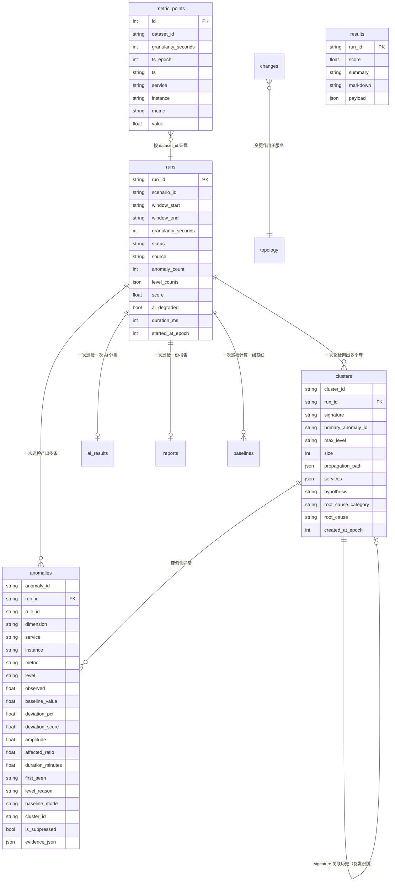

# 数据结构说明

> 领域模型：`staguard/models/`　|　表结构：`staguard/store/schema.py`

---

## 一、数据在链路中的形态变化

```
外部数据源            采集             清洗            存储               规则            聚合             聚类             AI
─────────────  →  ──────────  →  ──────────  →  ──────────  →  ──────────  →  ──────────  →  ──────────  →  ──────────
SeriesBlob        MetricPoint    MetricPoint   metric_points   AnomalyFinding   Anomaly         AnomalyCluster    AIAnalysis
(紧凑数组)         (归一化点)      (标准化点)     (时序表)        (原始发现)       (去重异常)       (根因簇)          (根因结论)
                                                   │
                                                   ├── baselines     (基线快照)
                                                   ├── changes       (变更事件)
                                                   ├── runs          (巡检运行)
                                                   ├── anomalies     (异常清单)
                                                   ├── clusters      (根因簇 + 签名)
                                                   ├── ai_results    (AI 结论 + 元信息)
                                                   └── reports       (报告正文 + 快照)
```

**为什么要有四层异常/结论结构**：每一层回答一个不同的问题——
「规则看到了什么」→「实际有几个问题」→「这些问题的根在哪」→「根因是什么、怎么修」。
把四层压成一层，要么报告刷屏，要么归因失去上下文。

## 二、实体关系



## 三、核心领域模型

### MetricPoint / MetricSeries（指标）

```python
class MetricPoint:            # 归一化后的单个指标点
    ts: datetime
    service: str
    instance: str
    metric: MetricName
    value: float

class MetricSeries:           # 一条时序，规则引擎的统计基元
    service: str
    instance: str
    metric: MetricName
    points: list[tuple[datetime, float]]
    # 提供 mean / percentile / worst / cv / slope / trend_stats / digest
```

`MetricSeries.digest()` 是给 AI 证据包用的紧凑统计摘要——
不投喂原始时序，只给分布与趋势，省 token 也避免模型淹死在数字里。

**指标目录（10 个）**：

| 维度 | 指标 | 单位 | 方向 |
| --- | --- | --- | --- |
| 业务 | `qps` | req/s | 双向（突增/突降） |
| 业务 | `success_rate` | % | 越高越好 |
| 业务 | `error_count` | count | 越低越好 |
| 业务 | `business_error_rate` | % | 越低越好 |
| 性能 | `latency_p50` / `latency_p95` / `latency_p99` | ms | 越低越好 |
| 资源 | `cpu_usage` / `mem_usage` / `conn_usage` | % | 越低越好 |

### Baseline（动态基线）

```python
class Baseline:
    median / mad / mad_scaled         # 稳健统计量（mad_scaled = max(1.4826×MAD, 0.8%×|median|)）
    mean / stdev / p50 / p95 / p99    # 辅助统计量
    min / max / sample_size           # 样本信息
    profile: dict[int, float]         # hour-of-day -> 历史中位数（波峰波谷展示）
    mode: BaselineMode                # dynamic / static_fallback / missing
    static_min / static_max / static_k
    # upper / lower / z_score / deviation_pct / confidence / is_usable
```

`mode` 会一路传到报告——读报告的人必须能分清
「这是和历史比出来的」与「这是拿固定红线卡出来的」。

### AnomalyFinding → Anomaly → AnomalyCluster（异常三层）

```python
class AnomalyFinding:        # 规则原始输出
    rule_id / dimension / service / instance / metric
    level: Severity          # P1 紧急 / P2 严重 / P3 一般 / P4 轻微
    observed / baseline_value / deviation_pct / z_score
    deviation_score / amplitude / affected_ratio / duration_minutes
    window: TimeWindow       # start = 异常真正的起始时刻
    level_reason: str        # 人话的级别理由（报告原样展示）
    baseline_mode / baseline_confidence
    evidence: dict           # 额外事实，会作为 evidence_id 的载体交给 AI

class Anomaly:               # 去重融合后（报告「异常清单」一行就是它）
    anomaly_id               # = dedup_key = rule_id|service|instance|metric
    merged_count             # 被合并的原始发现条数
    related_rule_ids         # 同指标上关联的其它规则
    cluster_id / is_suppressed / suppressed_by / is_recurring
    # recompute_score(criticality, affected_ratio) —— 聚合阶段回填影响面后重算

class AnomalyCluster:        # 根因簇
    cluster_id / primary / members
    propagation_path         # 影响传播方向（下游 → 上游）
    hypothesis               # 规则侧的传播假设（与 AI 结论并列展示）
    services / max_level
    # signature() —— 服务.指标 token 集合，用于复发识别（Jaccard）
```

### InspectionRun / ScoreResult / InspectionReport

```python
class InspectionRun:
    run_id / scenario_id / window / granularity_seconds
    started_at / finished_at / status   # running / succeeded / partial / failed
    source                               # file / http
    stages: list[StageRecord]            # 十个阶段的耗时与状态
    anomaly_count / level_counts / score / ai_degraded
    scope_services / scope_instances
    # duration_ms / highest_level

class ScoreResult:
    rule_score / ai_adjust / total / grade / capped_by
    breakdown: list[ScoreBreakdownItem]  # 逐项扣分与依据

class InspectionReport:      # 报告渲染模块的唯一输入
    run / score / anomalies / clusters
    ai / ai_meta / data_quality / baselines / changes
    comparison / history / rule_stats
```

### AIAnalysis / AIMeta（AI 结论）

```python
class AIAnalysis:
    overall_score_adjust: int            # 硬边界 ±5
    summary: str
    findings: list[Finding]              # cluster_id + 根因类别 + 证据引用 + 建议
    trend: TrendJudgement                # direction / reasoning / forecast
    stability_advice: list[str]
    uncertainties: list[str]             # 自陈证据不足

class AIMeta:
    provider / model
    degraded: bool / degraded_reason     # 降级必须留痕
    attempts / prompt_tokens / completion_tokens / latency_ms / prompt_version
```

## 四、表结构要点

### metric_points（时序）

| 列 | 说明 |
| --- | --- |
| `dataset_id` | 数据集分区。`archive` = 14 天干净历史（供基线），场景 ID = 含故障注入的切片 |
| `granularity_seconds` | 采样粒度。归档用 300s（基线是统计量，不需要分钟级），检测用 60s |
| `ts_epoch` | **查询与索引使用的绝对时间**（整数） |
| `ts` | ISO 字符串，仅供人肉排查 |

索引：
- `ix_mp_series (dataset_id, metric, service, instance, ts_epoch)` —— 单序列区间扫描；
- `ix_mp_scan (dataset_id, granularity_seconds, ts_epoch)` —— 按粒度的时间范围扫描。

**为什么时间用 epoch 而不是 DateTime**：
SQLite 的 DateTime 不支持时区，一旦混用「有时区」和「无时区」的 datetime 做范围查询，
结果会静默偏移数小时，而且极难发现。这条约定从设计上消灭了这类 bug。

**为什么数据集要分区**：动态基线的样本来自 `archive`。
如果历史里混着被注入的故障，基线会被永久抬高，此后同类故障全部漏报——
而且失效方式是静默的。

### clusters（根因簇）

`signature` 列建了索引。它是「跨 run 复发识别」的依据：
同样的异常组合再次出现时能立刻关联到历史。
**归因的记忆不需要向量库——一个稳定的签名加一个索引就够了。**

### runs / reports

- `level_counts` 用字符串键（`{"P1": 1, ...}`），避免 JSON 序列化把整型键改写；
- `reports.payload` 存整份 `InspectionReport` 的快照，
  于是历史报告可以在模型/规则演进后仍然原样重现。

## 五、配置数据结构

| 文件 | 顶层结构 | 作用 |
| --- | --- | --- |
| `config/services.yaml` | `default_slo` + `services{}` | 服务清单、依赖拓扑、关键度、SLO |
| `config/thresholds.yaml` | `defaults{}` + `overrides{}` | 静态红线与按服务的覆盖 |
| `config/rules.yaml` | `rules[]` | 16 条规则的启停、参数与分级条件 |
| `config/scoring.yaml` | `dimensions[]` + `caps[]` | 评分权重与封顶规则 |
| `config/scenarios.yaml` | `dataset_end` + `scenarios[]` | 数据集时间锚点与 7 个故障场景 |
| `data/changes.yaml` | `changes[]` | 变更事件（含背景干扰项） |

`dataset_end` 是**可复现性的根基**：固定它之后，同一份配置跑两次
必然得到同一份数据、同一份报告、同一个分数。
生产环境把这一项留空即可取当前时间。
